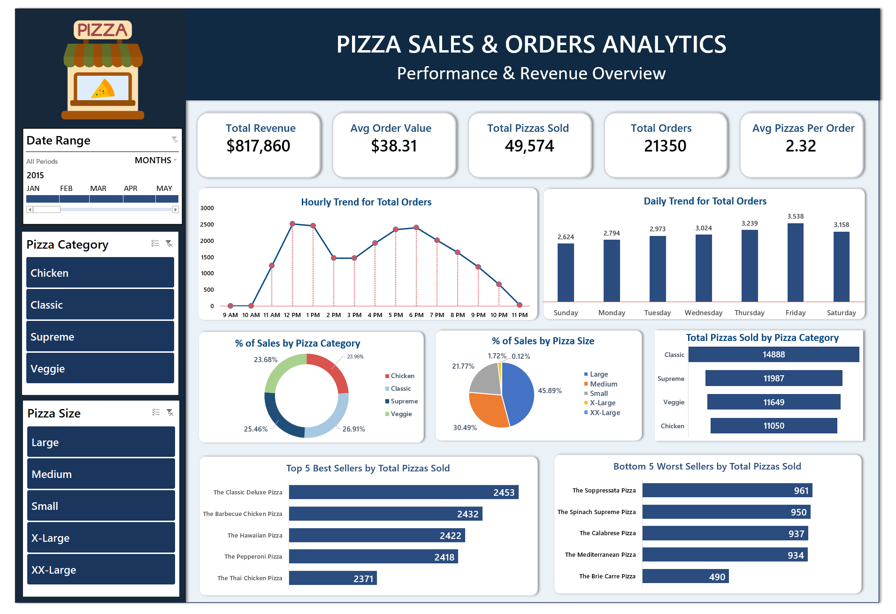
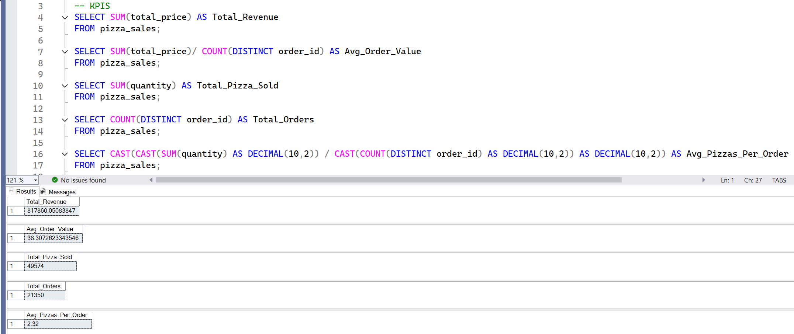
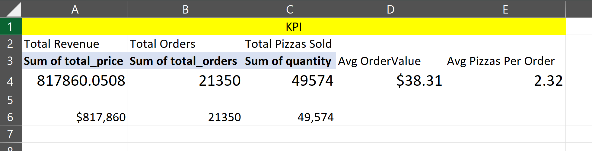
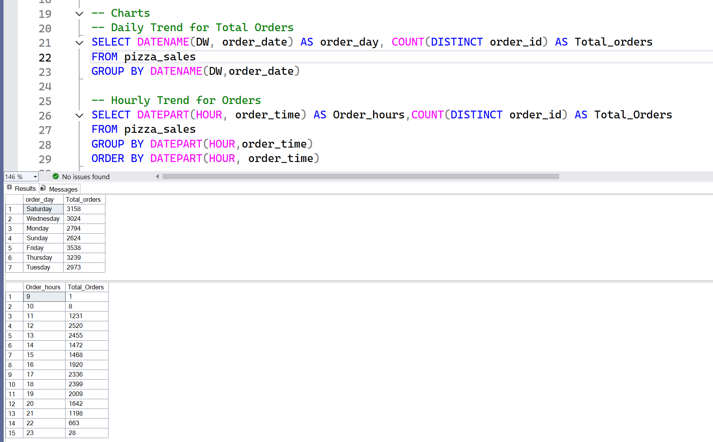
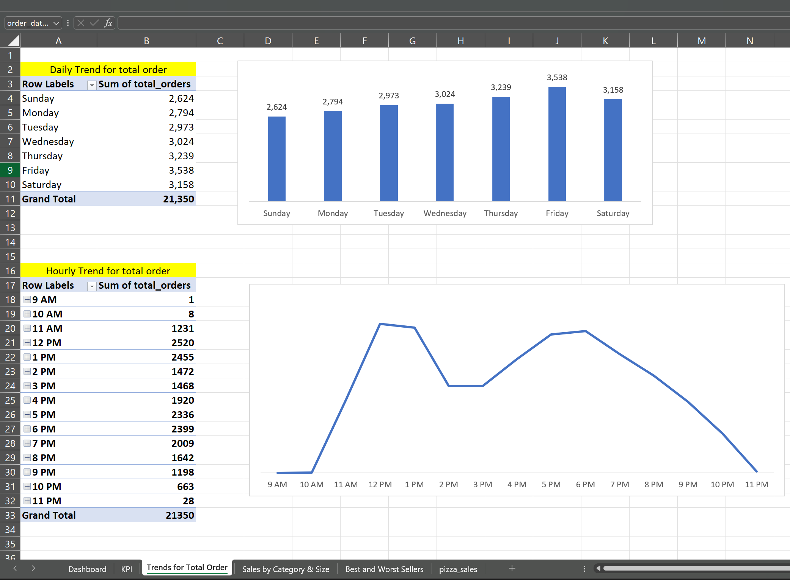
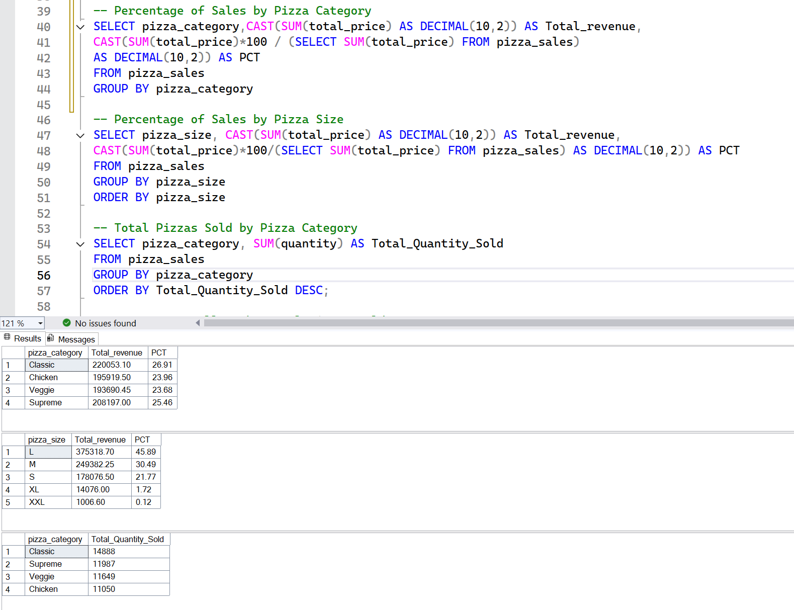
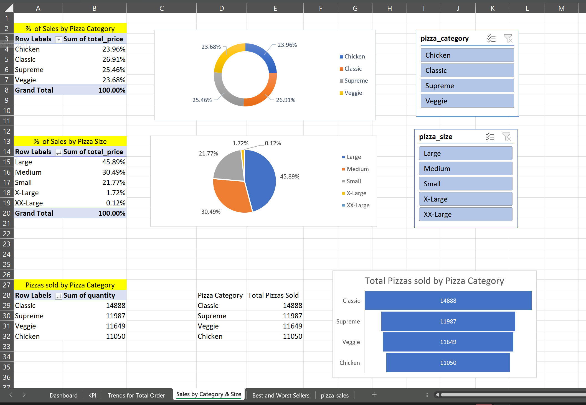

# Pizza Sales & Orders Analytics (SQL & Excel)

An end-to-end data analysis project exploring pizza sales data to evaluate business performance, identify peak ordering patterns, analyze sales distributions across categories and sizes, and uncover key revenue drivers using **SQL Server** and **Microsoft Excel**.

---

## Project Access & Resources

*  **Live Interactive Excel Dashboard:** [View Live Report Here](https://1drv.ms/x/c/CA5C55EAF5C83190/IQCv41QqakqnQZf4g1Yj8AG8AamnvGC2Yt2Bi7cDAB_ECTY?e=lh2VAH)
*  **SQL Script**: [View Full SQL Queries](Pizza_Project.sql)
*  **Raw Dataset**: [Access Raw CSV Dataset](pizza_sales.csv)

  ---
## Dashboard Landing Page

---
## Problem Statement

A high-volume pizzeria business requires clear insights into its operational efficiency, sales trends, and customer buying preferences. Key performance metrics were fragmented across raw transactional records containing over 49,000 individual pizza sales. 

This project solves these challenges by leveraging **SQL Queries** to execute data extraction and aggregations, paired with an **Interactive Excel Dashboard** utilizing Pivot Tables, Slicers, and visual charts for executive decision-making.

---
## Phase 1: Key Performance Indicators (KPIs) Analysis

To measure business performance, core metrics were computed in **SQL Server** and cross-verified against **Microsoft Excel** pivot tables.
| Metric | SQL Query | SSMS Output & Excel Validation |
| :--- | :--- | :--- |
| **Total Revenue** | `SELECT SUM(total_price) AS Total_Revenue FROM pizza_sales;` | **$817,860.05** |
| **Avg Order Value** | `SELECT (SUM(total_price) / COUNT(DISTINCT order_id)) AS Avg_order_Value FROM pizza_sales;` | **$38.31** |
| **Total Pizzas Sold** | `SELECT SUM(quantity) AS Total_pizza_sold FROM pizza_sales;` | **49,574 units** |
| **Total Orders** | `SELECT COUNT(DISTINCT order_id) AS Total_Orders FROM pizza_sales;` | **21,350 orders** |
| **Avg Pizzas / Order** | `SELECT CAST(CAST(SUM(quantity) AS DECIMAL(10,2)) / CAST(COUNT(DISTINCT order_id) AS DECIMAL(10,2)) AS DECIMAL(10,2)) AS Avg_Pizzas_per_order FROM pizza_sales;` | **2.32 units** |

#### SQL Execution & Query Outputs

Below are the SSMS SQL queries alongside their live execution output results:

### Excel Baseline Verification
To verify data integrity across platforms, database calculations were checked against the Excel Pivot aggregation summary:

---
 ## Phase 2: Daily & Hourly Order Trends Analysis

 Analyzes customer order density across days of the week and hours of the day to identify peak demand windows.
 #### SQL Execution & Query Outputs
Below are the SSMS SQL queries alongside their live execution output results:

#### Excel Baseline Verification
To verify trend accuracy, the query outputs were validated against the Excel Pivot Charts:

* **Daily Trend:** Peak order volume occurs on **Friday (3,538 orders)** and **Thursday (3,239 orders)**.
* **Hourly Trend:** Order activity experiences two prominent surges during lunch (**12 PM – 1 PM**) and dinner (**5 PM – 7 PM**).

---
### Phase 3: Sales Distribution by Category & Size

This analysis breaks down overall store revenue and unit sales volume across pizza categories and size specifications. It helps identify top revenue drivers, customer sizing preferences, and inventory priorities for ingredients and pizza bases.

#### SQL Execution & Query Outputs
Below are the SSMS SQL queries alongside their live execution output results:

#### Excel Baseline Verification
To verify market share distributions and quantity totals, the query outputs were validated against the Excel Pivot Charts:

* **Category Revenue Share:** **Classic** generates the highest sales share at **26.91%** ($220,053.10), closely followed by **Supreme** at **25.46%** ($208,197.00).
* **Size Revenue Share:** **Large (L)** size dominates revenue with **45.89%** ($375,318.70), while **Medium (M)** contributes **30.49%** ($249,382.25).
* **Total Units Sold by Category:** **Classic** leads total volume with **14,888 pizzas sold**, followed by **Supreme** (**11,987**), **Veggie** (**11,649**), and **Chicken** (**11,050**).
